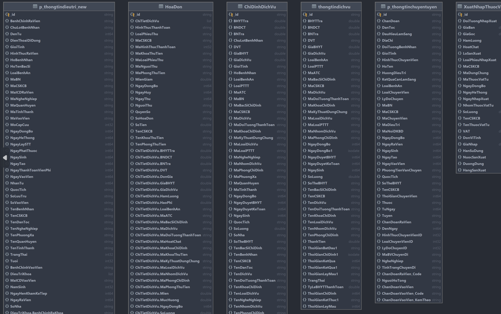
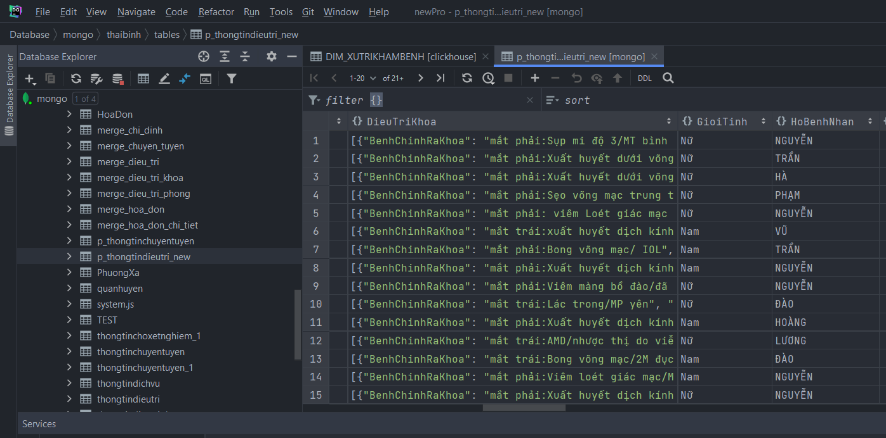
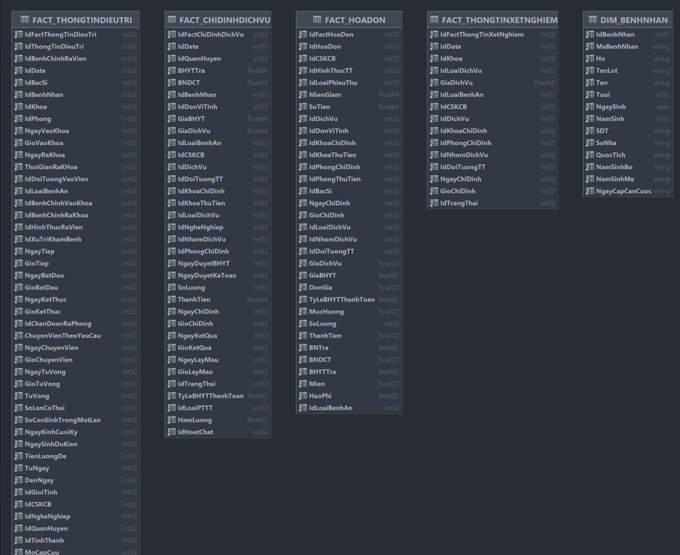
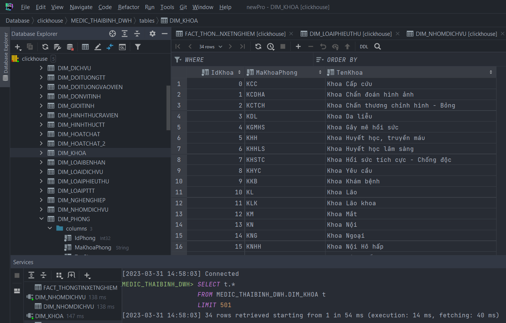

# Build flow etl medical data

## Source data:
Medical data of ThaiBinh province, stored in MongoDb  
Preview schema of database:  

  
    

  

   

## Data modeling:
Some Fact table and Dimension table:  

  

## Data flow:
After consider runtime of all tasks, pipeline is constructed as follows:

  

## Result of Etl process:

  

  

  
